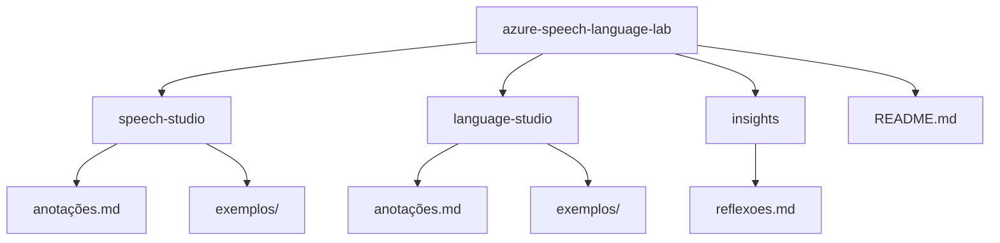
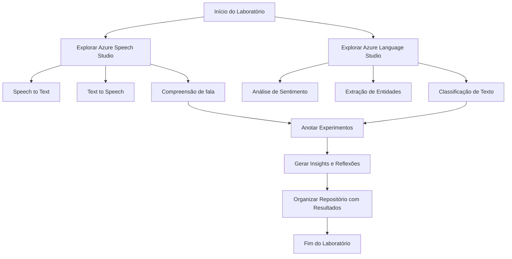

# Laboratório de Análise de Fala e Linguagem Natural com Azure

## 📌 Descrição

Este laboratório tem como objetivo praticar e aprofundar o uso das ferramentas **Azure Speech Studio** e **Azure Language Studio**, com foco na análise de fala e linguagem natural. A proposta é explorar recursos de inteligência artificial voltados para voz e linguagem, desenvolvendo habilidades práticas na criação de soluções aplicadas a diferentes contextos.

---

## 🎯 Objetivos

- Explorar funcionalidades do **Azure Speech Studio**, como:
  - Conversão de fala em texto (Speech to Text)
  - Conversão de texto em fala (Text to Speech)
  - Reconhecimento de intenção e comandos por voz
- Utilizar o **Azure Language Studio** para:
  - Análise de sentimentos
  - Extração de entidades
  - Classificação de texto e compreensão de linguagem natural
- Documentar o processo de aprendizado, desafios enfrentados e soluções adotadas
- Produzir insights relevantes para futuras implementações com IA na área de linguagem

---

## 📁 Estrutura do Repositório

---

## 🛠️ Tecnologias Utilizadas

- [Azure Speech Studio](https://speech.microsoft.com/)
- [Azure Language Studio](https://language.azure.com/)
- Conta Microsoft Azure ativa

---

## 🧭 Fluxo do Laboratório

---

## 📚 Requisitos

- Navegador atualizado
- Conta no Microsoft Azure com permissão para uso das ferramentas cognitivas
- Conhecimento básico em IA aplicada à linguagem (desejável)

---

## ✅ Entregável

O entregável deste laboratório é **um repositório organizado** com:

- Anotações detalhadas das atividades
- Prints ou capturas das ferramentas em uso
- Exemplos de entrada e saída dos testes realizados
- Reflexões e considerações finais sobre o uso prático das ferramentas

---

## 🧠 Resultados Esperados

- Maior familiaridade com as ferramentas de IA da Microsoft voltadas para linguagem
- Capacidade de configurar e testar soluções de voz e linguagem natural
- Compilação de anotações úteis para revisões e projetos futuros

---

## 🤖 Possíveis Aplicações Futuras

- Chatbots com comandos de voz
- Análise de sentimentos em redes sociais
- Assistentes virtuais para inclusão digital
- Sistemas de acessibilidade baseados em fala

---

## 📄 Licença

Este projeto é de caráter acadêmico e segue as diretrizes de uso educacional. Para fins comerciais, consulte as licenças de uso das ferramentas Microsoft Azure.
